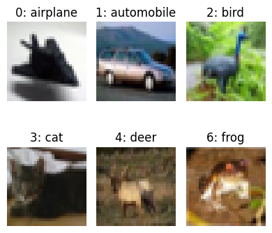
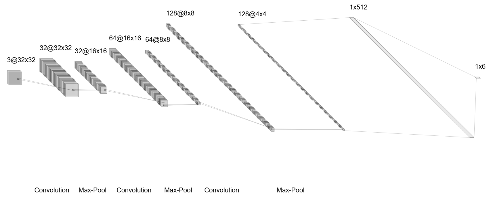
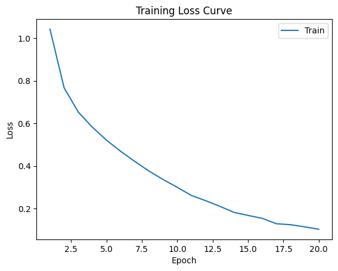
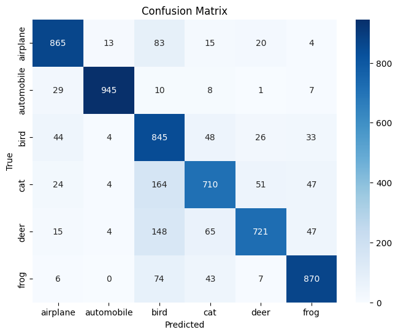

# Image Classification - CIFAR 10
## 任务要求
图像分类任务是计算机视觉领域中的一种常见任务，其目标是将输入的图像分为不同的类别或类别标签。本作业将使用 *CIFAR 10* 数据集练习*卷积神经网络*的搭建。

要求：任意版本 PyTorch。**请不要直接调用 PyTorch 官方搭建好的模型，需逐层搭建。**

其中 CIFAR 10 一共有 10 个类别，每个同学只进行其中的 6 个类别分类，具体分类类别后续会以csv文件形式发布。报告使用 Latex 模板完成。

## 数据集
### 下载链接
[CIFAR-10 and CIFAR-100 datasets (toronto.edu)](https://www.cs.toronto.edu/~kriz/cifar.html)

### 类别
CIFAR-10 数据集中，10 个类别及其对应的序号如下：

0. 飞机 (airplane)
0. 汽车 (automobile)
0. 鸟 (bird)
0. 猫 (cat)
0. 鹿 (deer)
0. 狗 (dog)
0. 青蛙 (frog)
0. 马 (horse)
0. 船 (ship)
0. 卡车 (truck)

本次抽到的 6 个类别为：`(0, 1, 2, 3, 4, 6)`

## 评估
请使用 Accuracy、Recall、Precision、F1-score、AUROC 进行定量评估，并绘制混淆矩阵进行可视化。请给出训练过程中的损失函数下降曲线。

请将 6 个类别的图像进行可视化并标好类别名称，**要求每个类别都有**。

## 网络

## 结果

